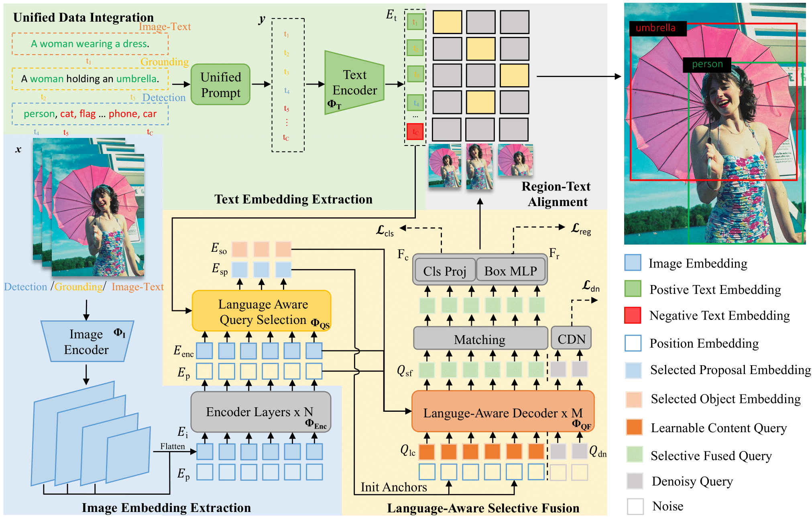

<div align="center">
<h1>🦖 OV-DINO </h1>
<h3>Unified Open-Vocabulary Detection with Language-Aware Selective Fusion</h3>

[Hao Wang](https://github.com/wanghao9610)<sup>1,2</sup>,[Pengzhen Ren](https://scholar.google.com/citations?user=yVxSn70AAAAJ&hl)<sup>1</sup>,[Zequn Jie](https://scholar.google.com/citations?user=4sKGNB0AAAAJ&hl)<sup>3</sup>, [Xiao Dong](https://scholar.google.com.sg/citations?user=jXLkbw8AAAAJ&hl)<sup>1</sup>, [Chengjian Feng](https://fcjian.github.io/)<sup>3</sup>, [Yinlong Qian](https://scholar.google.com/citations?user=8tPN5CAAAAAJ&hl)<sup>3</sup>,

[Lin Ma](https://forestlinma.com/)<sup>3</sup>, [Dongmei Jiang](https://scholar.google.com/citations?user=Awsue7sAAAAJ&hl)<sup>2</sup>, [Yaowei Wang](https://scholar.google.com/citations?user=o_DllmIAAAAJ&hl)<sup>2,4</sup>, [Xiangyuan Lan](https://scholar.google.com/citations?user=c3iwWRcAAAAJ&hl)<sup>2</sup><sup>:email:</sup>, [Xiaodan Liang](https://scholar.google.com/citations?user=voxznZAAAAAJ&hl)<sup>1,2</sup><sup>:email:</sup>

<sup>1</sup> Sun Yat-sen University, <sup>2</sup> Pengcheng Lab, <sup>3</sup> Meituan Inc, <sup>4</sup> HIT, Shenzhen

<sup>:email:</sup> corresponding author.

[[`Paper`](https://arxiv.org/abs/2407.07844)] [[`HuggingFace`](https://huggingface.co/hao9610/ov-dino-tiny)] [[`Demo`](http://47.115.200.157:7860)] [[`BibTex`](#pushpin-citation)]

</div>
<div align="center">
<div align="left" style="display: inline-block; text-align: left;">

[](https://paperswithcode.com/sota/zero-shot-object-detection-on-mscoco?p=ov-dino-unified-open-vocabulary-detection)
[](https://paperswithcode.com/sota/zero-shot-object-detection-on-lvis-v1-0?p=ov-dino-unified-open-vocabulary-detection)
[](https://paperswithcode.com/sota/zero-shot-object-detection-on-lvis-v1-0-val?p=ov-dino-unified-open-vocabulary-detection)

</div>
</div>

## :fire: Updates

- **`16/08/2024`**: :sparkles: Have a look!!! We update the pre-training code on O365 dataset. You could try to reproduce our results.

- **`06/08/2024`**: :sparkler: Awesome!!! **OV-SAM = OV-DINO + SAM2**. We update OV-SAM marrying OV-DINO with SAM2 on the [online demo](http://47.115.200.157:7860).

- **`16/07/2024`**: We provide the [online demo](http://47.115.200.157:7860), **click and enjoy** !!! NOTE: You uploaded image will be stored for failure analysis.

- **`16/07/2024`**: We release the web inference demo, try to deploy it by yourself.

- **`15/07/2024`**: We release the fine-tuning code, try to fine-tune on your custom dataset. Feel free to raise issue if you encounter some problem.

- **`15/07/2024`**: We release the local inference demo, try to deploy OV-DINO on you local machine and run inference on images.

- **`14/07/2024`**: We release the pre-trained models and the evaluation code.

- **`11/07/2024`**: We release OV-DINO paper on arxiv. Code and pre-trained model are coming soon.

## :rocket: Introduction
This project contains the official PyTorch implementation, pre-trained models, fine-tuning code, and inference demo for OV-DINO.

* OV-DINO is a novel unified open vocabulary detection approach that offers superior performance and effectiveness for practical real-world application.

* OV-DINO entails a Unified Data Integration pipeline that integrates diverse data sources for end-to-end pre-training, and a Language-Aware Selective Fusion module to improve the vision-language understanding of the model.

* OV-DINO shows significant performance improvement on COCO and LVIS benchmarks compared to previous methods, achieving relative improvements of +2.5\% AP on COCO and +12.7\% AP on LVIS compared to G-DINO in zero-shot evaluation.

## :page_facing_up: Overview



## :sparkles: Model Zoo
| Model    | Pre-Train Data  | AP<sup>mv</sup> | AP<sub>r</sub>  | AP<sub>c</sub>  | AP<sub>f</sub>  | AP<sup>val</sup> | AP<sub>r</sub>  | AP<sub>c</sub>  | AP<sub>f</sub> | AP<sup>coco</sup> | Weights |
| -------- | --------------- | ---- | ---- | ---- | ---- | ----- | ---- | ---- | ---- | --------- | ------- |
| OV-DINO<sup>1</sup> | O365            | 24.4 | 15.5 | 20.3 | 29.7 | 18.7  | 9.3  | 14.5 | 27.4 | 49.5 / 57.5 |  🤗[CKPT](https://huggingface.co/hao9610/OV-DINO/resolve/main/ovdino_swint_o-coco49.5_lvismv24.4_lvis18.7.pth) / [LOG]()      |
| OV-DINO<sup>2</sup> | O365,GoldG      | 39.4 | 32.0 | 38.7 | 41.3 | 32.2  | 26.2 | 30.1 | 37.3 | 50.6 / 58.4 |   🤗[CKPT](https://huggingface.co/hao9610/OV-DINO/resolve/main/ovdino_swint_og-coco50.6_lvismv39.4_lvis32.2.pth)      |
| OV-DINO<sup>3</sup> | O365,GoldG,CC1M<sup>&ddagger;</sup> | 40.1 | 34.5 | 39.5 | 41.5 | 32.9  | 29.1 | 30.4 | 37.4 | 50.2 / 58.2 |   [HF CKPT🤗](https://huggingface.co/hao9610/OV-DINO/resolve/main/ovdino_swint_ogc-coco50.2_lvismv40.1_lvis32.9.pth)      |

 **NOTE**: AP<sup>mv</sup> denotes the zero-shot evaluation results on LVIS MiniVal, AP<sup>val</sup> denotes the zero-shot evaluation results on LVIS Val, AP<sup>coco</sup> denotes (zero-shot / fine-tune) evaluation results on COCO, respectively.

## :checkered_flag: Getting Started
### 1. Project Structure
```
OV-DINO
├── datas
│   ├── o365
│   │   ├── annotations
│   │   ├── train
│   │   ├── val
│   │   └── test
│   ├── coco
│   │   ├── annotations
│   │   ├── train2017
│   │   └── val2017
│   ├── lvis
│   │   ├── annotations
│   │   ├── train2017
│   │   └── val2017
│   └── custom
│       ├── annotations
│       ├── train
│       └── val
├── docs
├── inits
│   ├── huggingface
│   ├── ovdino
│   ├── sam2
│   └── swin
├── ovdino
│   ├── configs
│   ├── demo
│   ├── detectron2-717ab9
│   ├── detrex
│   ├── projects
│   ├── scripts
│   └── tools
├── wkdrs
│   ├── ...
│
```

### 2. Installation
```bash
# clone this project
git clone https://github.com/wanghao9610/OV-DINO.git
cd OV-DINO
export root_dir=$(realpath ./)
cd $root_dir/ovdino

# create conda env for ov-dino
conda create -n ovdino -y
conda activate ovdino
conda install pytorch==1.13.1 torchvision==0.14.1 torchaudio==0.13.1 pytorch-cuda=11.6 -c pytorch -c nvidia -y
conda install gcc=9 gxx=9 -c conda-forge -y # Optional: install gcc9
python -m pip install -e detectron2-717ab9
pip install -e ./

# Optional: create conda env for ov-sam, it may not compatible with ov-dino, so we create a new env.
# ov-sam = ov-dino + sam2
conda create -n ovsam -y
conda activate ovsam
conda install pytorch==2.3.1 torchvision==0.18.1 torchaudio==2.3.1 pytorch-cuda=12.1 -c pytorch -c nvidia -y
# install the sam2 following the sam2 project.
# please refer to https://github.com/facebookresearch/segment-anything-2.git
# download sam2 checkpoints and put them to inits/sam2
python -m pip install -e detectron2-717ab9
pip install -e ./
```

### 2. Data Preparing
#### COCO
* Download [COCO](https://cocodataset.org/#download) from the official website, and put them on datas/coco folder.
  ```bash
  cd $root_dir
  mkdir -p datas/coco
  wget http://images.cocodataset.org/zips/train2017.zip -O datas/coco/train2017.zip
  wget http://images.cocodataset.org/zips/val2017.zip -O datas/coco/val2017.zip
  wget http://images.cocodataset.org/annotations/annotations_trainval2017.zip -O datas/coco/annotations_trainval2017.zip
  ```
* Extract the ziped files, and remove them:
  ```bash
  cd $root_dir
  unzip datas/coco/train2017.zip -d datas/coco
  unzip datas/coco/val2017.zip -d datas/coco
  unzip datas/coco/annotations_trainval2017.zip -d datas/coco
  rm datas/coco/train2017.zip datas/coco/val2017.zip datas/coco/annotations_trainval2017.zip
  ```

#### LVIS
* Download LVIS annotation files:
  ```bash
  cd $root_dir
  mkdir -p datas/lvis
  wget https://huggingface.co/hao9610/OV-DINO/resolve/main/lvis_v1_minival_inserted_image_name.json -O datas/lvis/annotations/lvis_v1_minival_inserted_image_name.json
  wget https://huggingface.co/hao9610/OV-DINO/resolve/main/lvis_v1_val_inserted_image_name.json -O datas/lvis/annotations/lvis_v1_val_inserted_image_name.json
  ```
* Soft-link COCO to LVIS:
  ```bash
  cd $root_dir
  ln -s $(realpath datas/coco/train2017) datas/lvis
  ln -s $(realpath datas/coco/val2017) datas/lvis
  ```

#### Objects365
* Refer to the [OpenDataLab](https://opendatalab.com/OpenDataLab/Objects365_v1/cli/main) for Objects365V1 download, which has provided detailed download instruction.
  ```bash
  cd $root_dir
  mkdir -p datas/o365/annotations
  # Suppose you download the Objects365 raw file and put them on datas/o365/raw, extract the tared files and reorder them.
  cd datas/o365/raw
  tar -xvf Objects365_v1.tar.gz
  cd 2019-08-02
  for file in *.zip; do unzip -o "$file"; done
  mv *.json $root_dir/datas/o365/annotations
  mv train val test $root_dir/datas/o365
  ```
### 3. Evaluation
Download the pre-trained model from [Model Zoo](#model-zoo), and put them on inits/ovdino directory.
```bash
cd $root_dir/ovdino
bash scripts/eval.sh path_to_eval_config_file path_to_pretrained_model output_directory
```

#### Zero-Shot Evaluation on COCO Benchmark
```bash
cd $root_dir/ovdino
bash scripts/eval.sh \
  projects/ovdino/configs/ovdino_swin_tiny224_bert_base_eval_coco.py \
  ../inits/ovdino/ovdino_swint_og-coco50.6_lvismv39.4_lvis32.2.pth \
  ../wkdrs/eval_ovdino
```
#### Zero-Shot Evaluation on LVIS Benchmark
```bash
cd $root_dir/ovdino
bash scripts/eval.sh \
  projects/ovdino/configs/ovdino_swin_tiny224_bert_base_eval_lvismv.py \
  ../inits/ovdino/ovdino_swint_ogc-coco50.2_lvismv40.1_lvis32.9.pth \
  ../wkdrs/eval_ovdino

bash scripts/eval.sh \
  projects/ovdino/configs/ovdino_swin_tiny224_bert_base_eval_lvis.py \
  ../inits/ovdino/ovdino_swint_ogc-coco50.2_lvismv40.1_lvis32.9.pth \
  ../wkdrs/eval_ovdino
```

### 4. Fine-Tuning
#### Fine-Tuning on COCO Dataset
```bash
cd $root_dir/ovdino
bash scripts/finetune.sh \
  projects/ovdino/configs/ovdino_swin_tiny224_bert_base_ft_coco_24ep.py \
  ../inits/ovdino/ovdino_swint_og-coco50.6_lvismv39.4_lvis32.2.pth
```

#### Fine-Tuning on Custom Dataset
* Prepare your custom dataset as the COCO annotation format.

* Refer the following command to run fine-tuning.
  ```bash
  cd $root_dir/ovdino
  bash scripts/finetune.sh \
    projects/ovdino/configs/ovdino_swin_tiny224_bert_base_ft_custom_24ep.py \
    ../inits/ovdino/ovdino_swint_ogc-coco50.2_lvismv40.1_lvis32.9.pth
  ```
### 5. Pre-Training
#### Pre-Training on Objects365 dataset
* Download dataset following [Objects365 Data Preparing](#objects365).
* Refer the following command to run pre-training.
  
  On the first machine:
  ```bash
  cd $root_dir/ovdino
  # Replace $MASTER_PORT and $MASTER_ADDR with your actual machine settings.
  NNODES=2 NODE_RANK=0 MASTER_PORT=$MASTER_PORT MASTER_ADDR=$MASTER_ADDR \
  bash scripts/pretrain.sh \
    projects/ovdino/configs/ovdino_swin_tiny224_bert_base_pretrain_o365_24ep.py
  ```
  On the second machine:
  ```bash
  cd $root_dir/ovdino
  # Replace $MASTER_PORT and $MASTER_ADDR with your actual machine settings.
  NNODES=2 NODE_RANK=1 MASTER_PORT=$MASTER_PORT MASTER_ADDR=$MASTER_ADDR \
  bash scripts/pretrain.sh \
    projects/ovdino/configs/ovdino_swin_tiny224_bert_base_pretrain_o365_24ep.py
  ```
  NOTE: The default batch size for O365 pre-training is 64 in our experiments, and running on 2 nodes with 8 A100 GPUs per-node. If you encounter Out-of-Memory error, you can adjust the batch size and learning rate, total steps by linearly.
#### Pre-Training on [Objects365, GoldG] datasets
  
  Coming soon ...

#### Pre-Training on [Objects365, GoldG, CC1M‡] datasets

  Coming soon ...
  
*We will update the all pre-training code after our paper is accepted.*

## :computer: Demo
* Local inference on a image or folder give the category names.
  ```bash
  # for ovdino: conda activate ovdino
  # for ovsam: conda activate ovsam
  cd $root_dir/ovdino
  bash scripts/demo.sh demo_config.py pretrained_model category_names input_images_or_directory output_directory
  ```
  Examples:
  ```bash
  cd $root_dir/ovdino
  # single image inference
  bash scripts/demo.sh \
    projects/ovdino/configs/ovdino_swin_tiny224_bert_base_infer_demo.py \
    ../inits/ovdino/ovdino_swint_ogc-coco50.2_lvismv40.1_lvis32.9.pth \
    "class0 class1 class2 ..." img0.jpg output_dir/img0_vis.jpg

  # multi images inference
  bash scripts/demo.sh \
    projects/ovdino/configs/ovdino_swin_tiny224_bert_base_infer_demo.py \
    ../inits/ovdino/ovdino_swint_ogc-coco50.2_lvismv40.1_lvis32.9.pth \
    "class0 long_class1 long_class2 ..." "img0.jpg img1.jpg" output_dir

  # image folder inference
  bash scripts/demo.sh \
    projects/ovdino/configs/ovdino_swin_tiny224_bert_base_infer_demo.py \
    ../inits/ovdino/ovdino_swint_ogc-coco50.2_lvismv40.1_lvis32.9.pth \
    "class0 long_class1 long_class2 ..." image_dir output_dir
  ```
  NOTE: the input category_names are separated by spaces, and the words of single class are connected by underline (_).

* Web inference demo.

  ```bash
  cd $root_dir/ovdino
  bash scripts/app.sh \
    projects/ovdino/configs/ovdino_swin_tiny224_bert_base_infer_demo.py \
    ../inits/ovdino/ovdino_swint_ogc-coco50.2_lvismv40.1_lvis32.9.pth
  ```

  After the web demo deployment, you can open the [demo](http://127.0.0.1:7860) on your browser.

  **We also provide the [online demo](http://47.115.200.157:7860), click and enjoy.**

## :white_check_mark: TODO
- [x] Release the pre-trained model.
- [x] Release the fine-tuning and evaluation code.
- [x] Support the local inference demo.
- [x] Support the web inference demo.
- [ ] Support OV-DINO in 🤗 transformers.
- [ ] Release the pre-training code.

## :blush: Acknowledge
This project has referenced some excellent open-sourced repos ([Detectron2](https://github.com/facebookresearch/detectron2), [detrex](https://github.com/IDEA-Research/detrex), [GLIP](https://github.com/microsoft/GLIP), [G-DINO](https://github.com/IDEA-Research/GroundingDINO), [YOLO-World](https://github.com/AILab-CVC/YOLO-World)). Thanks for their wonderful works and contributions to the community.

## :pushpin: Citation
If you find OV-DINO is helpful for your research or applications, please consider giving us a star 🌟 and citing it by the following BibTex entry.

```bibtex
@article{wang2024ovdino,
  title={OV-DINO: Unified Open-Vocabulary Detection with Language-Aware Selective Fusion}, 
  author={Hao Wang and Pengzhen Ren and Zequn Jie and Xiao Dong and Chengjian Feng and Yinlong Qian and Lin Ma and Dongmei Jiang and Yaowei Wang and Xiangyuan Lan and Xiaodan Liang},
  journal={arXiv preprint arXiv:2407.07844},
  year={2024}
}
```